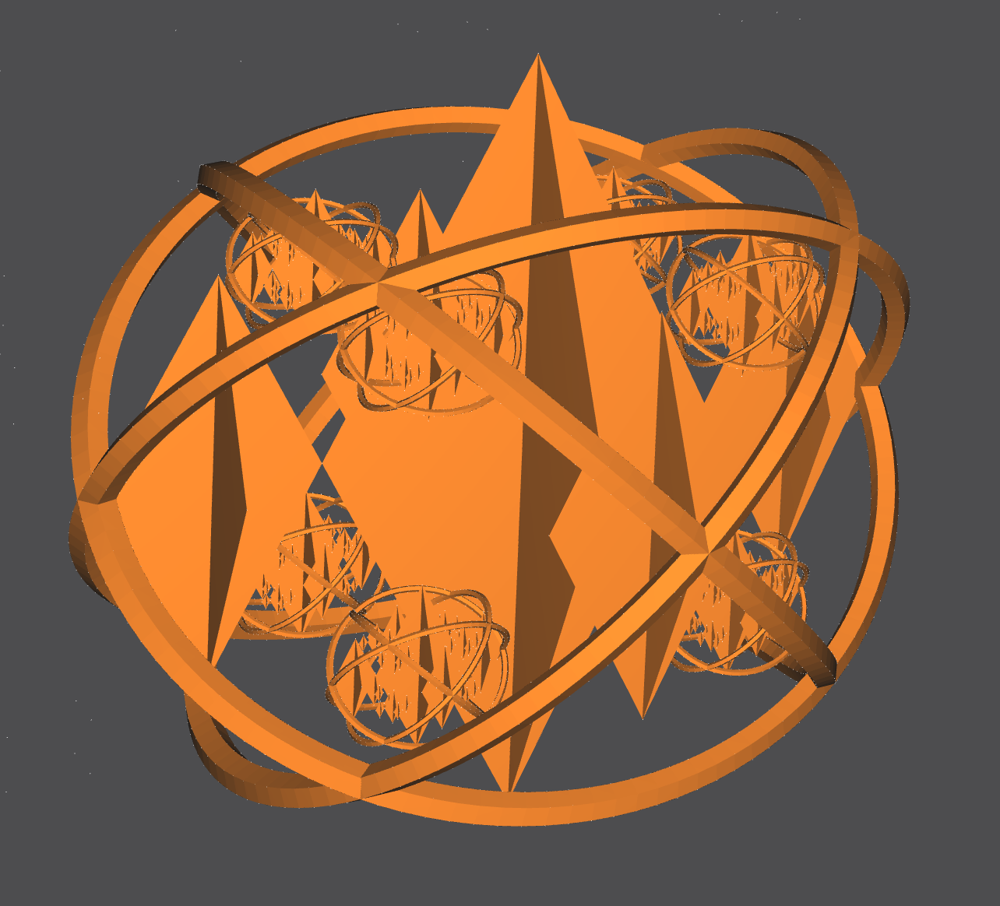
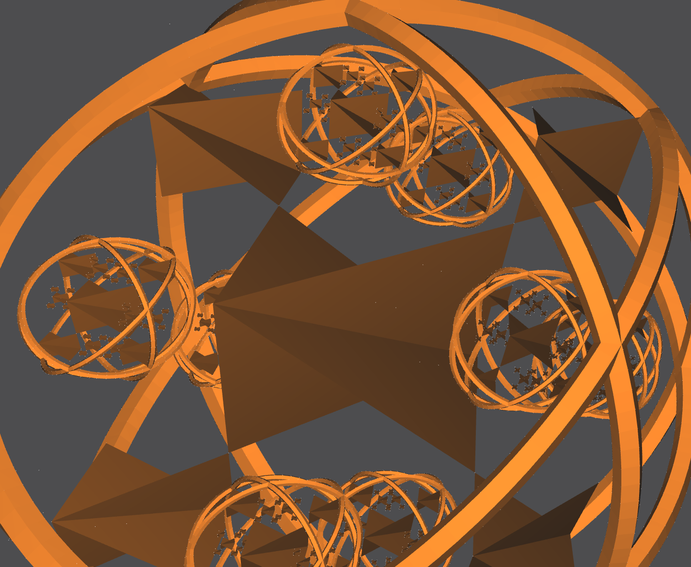
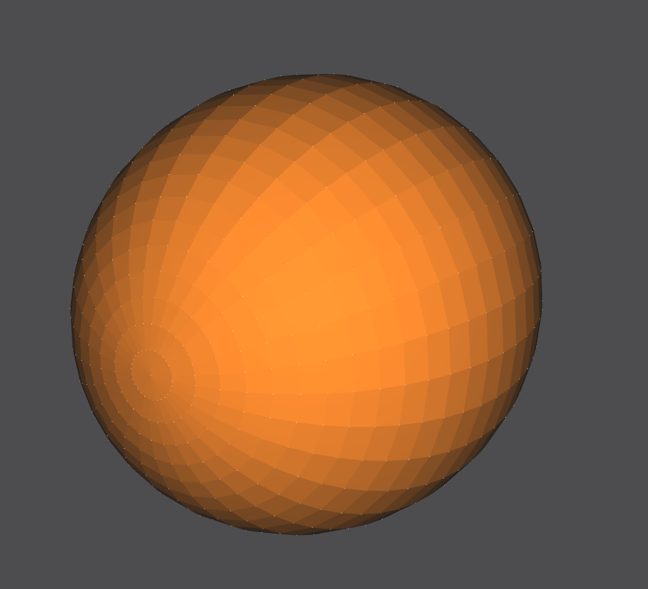

## A Dive into NOME3: The Non-Orientable Manifold Editor

NOME3 (Non-Orientable Manifold Editor) is an emerging new Computer-Aided-Design tool being developed by [Professor Carlo Sequin](https://people.eecs.berkeley.edu/~sequin/) and a team of undergraduate and graduate researchers at the University of California, Berkeley. It is specifically built to assist in the design of smooth but precise free-form geometries, such as those by artists like [Eva Hild](https://www.evahild.com/ceramics) or [Charles O. Perry](http://www.charlesperry.com/).

The project is built using C++ as the backend, with a proprietary [NOME language](https://github.com/randyfan/NOME3/wiki/NOME3-Language-Reference) used as the medium in which users can build their creations. The main up-to-date GitHub repository for the NOME3 Project, along with compilation and usage instructions, can be found [here](https://github.com/randyfan/NOME3).

Table of Contents
=================
* [How does NOME3 work?](#how-does-nome3-work)
* [My Contributions to the NOME3 Project](#my-contributions-to-the-nome3-project)
  - [Stress Test: Fractal Design](#stress-test-fractal-design)
  - [Stress Test: Klein Bottle](#stress-test-klein-bottle)
  - [Generator: Sphere](#generator-sphere)


## How does NOME3 work?

### Introduction
The NOME proprietary language is built around specifying meshes, groups, and instances. Meshes and groups can be turned into instances, which are then displayed on the UI.

A mesh is any basic generator that is defined within NOME3. These basic generators can be found [here](https://github.com/randyfan/NOME3/wiki/NOME3-Language-Reference), and can be combined in order to create more advanced and geometrically complicated shapes. Basic generators have parameters that further specify their shape and look, which allows for more flexibility in design.

A group is a number of meshes that have been 'grouped' together into a new mesh, that can then be treated as a singular mesh and have operations performed on. This allows for scalability in the design of more complicated shapes.

An instance of either a mesh or a group is created in order to actually bring an object into the scene. Instances of meshes or groups must be created in order for the mesh or group to be displayed. Multiple instances of the same mesh or group can also be created.

Further operations such as point selection, face deletion, line sweeps, subdivision, screen panning and rotation, etc.) can then be performed once the scene is loaded.

### NOME Language Example
An example of the interplay between meshes, groups, and instances can be seen here:
```markdown
point p1 (0 2 1) endpoint
point p2 (1 0 1) endpoint
point p3 (-1 0 1) endpoint

mesh triangle
    face f1 (p1 p2 p3) endface
endmesh

group diamond
	instance t0 triangle endinstance
	instance t1 triangle rotate (0 1 0) (90) translate (-1 0 1) endinstance
	instance t2 triangle rotate (0 0 1) (180) endinstance
	instance t3 triangle rotate (0 0 1) (180) rotate (0 1 0) (90) translate (-1 0 1) endinstance
endgroup

instance d1 diamond scale (25 25 25) translate (0 0 -25) endinstance
```

### Built in C++
Generators in the NOME3 Project are built in C++. OpenMesh points and faces are used as the underlying data structures, and ANTLR4 is used to define and parse the proprietary NOME Language.

An example of a typical Generator File in C++:
```cpp
DEFINE_META_OBJECT(CMobiusStrip)
{
    BindPositionalArgument(&CMobiusStrip::N, 1, 0);
    BindPositionalArgument(&CMobiusStrip::Radius, 1, 1);
    BindPositionalArgument(&CMobiusStrip::NumTwists, 1, 2);
    BindPositionalArgument(&CMobiusStrip::NumCuts, 1, 3);
}

void CMobiusStrip::UpdateEntity()
{
    if (!IsDirty())
        return;

    Super::UpdateEntity();

    // load in arguments to Mobius Strip generator
    float n = (float)N.GetValue(100.0f); // number of individual points on each band
    float radius = (float)Radius.GetValue(1.0f); // total radius
    int numTwists = (int)ceil(NumTwists.GetValue(1.0f)); // number of twists
    int numCuts = (int)ceil(NumCuts.GetValue(0.0f)); // number of times surface is cut
    float bandwidth = 2*radius/((numCuts*2) + 1); // radius of each band

    // create vertices
    float uIncrement = (1.0f/n)*(float)tc::M_PI;
    int uCounter = 0;
    for (float u = 0.0f; u < 2.f * (float)tc::M_PI + uIncrement/3; u += uIncrement)
    { // uIncrement/3 allows n+1 total vertices, accounting for rounding error (n+1th vertex == 0th vertex)
        int vCounter = 0;
        for (float v = -1*radius; v <= radius + bandwidth/3; v += bandwidth)
        { // bandwidth/3 accounts for rounding error
            float x = (1+(v/2.0f)*cosf((numTwists*u)/2.0f))*cosf(u);
            float y = (1+(v/2.0f)*cosf((numTwists*u)/2.0f))*sinf(u);
            float z = (v/2.0f)*sinf((numTwists*u)/2.0f);
            AddVertex("v_" + std::to_string(uCounter) + "_" + std::to_string(vCounter), // name ex. "v_0_5"
                      { x, y, z } );
            vCounter++;
        }
        uCounter++;
    }

    // add faces
    for (int uFaceCounter = 0; uFaceCounter + 1 < uCounter; uFaceCounter++)
    {
        for (int cut = 0; cut <= numCuts; cut++)
        {
            std::vector<std::string> face;

            face.push_back("v_" + std::to_string(uFaceCounter) + "_" + std::to_string(2*cut)); //2*cut
            face.push_back("v_" + std::to_string(uFaceCounter + 1) + "_" + std::to_string(2*cut));
            face.push_back("v_" + std::to_string(uFaceCounter + 1) + "_" + std::to_string(2*cut+1)); //2*cut+1
            face.push_back("v_" + std::to_string(uFaceCounter) + "_" + std::to_string(2*cut+1));

            AddFace("f1_" + std::to_string(uFaceCounter) + "_" + std::to_string(cut), face);
        }
    }
}
```

## My Contributions to the NOME3 Project

### Stress Test: Fractal Design
There are many steps that the NOME3 application goes through in order to generate an image. Upon loading in a file, NOME3 will parse the NOME language files and call the correct generator classes, create and calcualte the position of underlying OpenMesh points and faces, update with user-specified settings, and then draw them into the scene. This is very resource-intensive, and as such NOME3 is prone to crashes.

My first task was to build a stress test model in order to test the capabilities of the rendering packages that NOME3 uses. My design was 3 recursive repetitions of 3-dimensional diamonds made up of triangle instances surrounded by four toruses. This fractal display was built entirely using the NOME proprietary language.
#### The scene

 

#### Fractal Design
 

The NOM file containing the code can be found [here](https://github.com/Brandonyli/brandonyli.github.io/blob/main/hw1.nom).

### Stress Test: Klein Bottle
A Klein Bottle is a 2-dimensional manifold that has a non-orientable surface in 3-dimensions. The Klein Bottle is interesting because the surface has no boundary (like a sphere), and instead the 'spout' of the bottle wraps into itself and creates a tunnel at the bottom of the 'bottle'. This Klein Bottle was built entirely using the NOME proprietary language, with a Python Notebook script generating the NOME language lines.

#### The scene
 

#### The 'spout' and bottom


The bottom of the bottle has black-colored faces, which is a pecularity of the OpenMesh software in NOME3. Fear not, it is one continuous surface.


The NOM file containing the code can be found [here](https://github.com/Brandonyli/brandonyli.github.io/blob/main/kleinbottle.nom), with accompanying [.ipynb file](https://github.com/Brandonyli/brandonyli.github.io/blob/main/NOME%20File%20Generator%20Example.ipynb).

### Generator: Sphere
This is my generator for a sphere, which was built in C++. It takes in 5 parameters that control the sphere's number of segments, radius, cut, etc.

#### The scene

 

The NOM file containing the C++ generator files and an example NOM file can be found [here](https://github.com/Brandonyli/brandonyli.github.io/tree/main/sphere).
