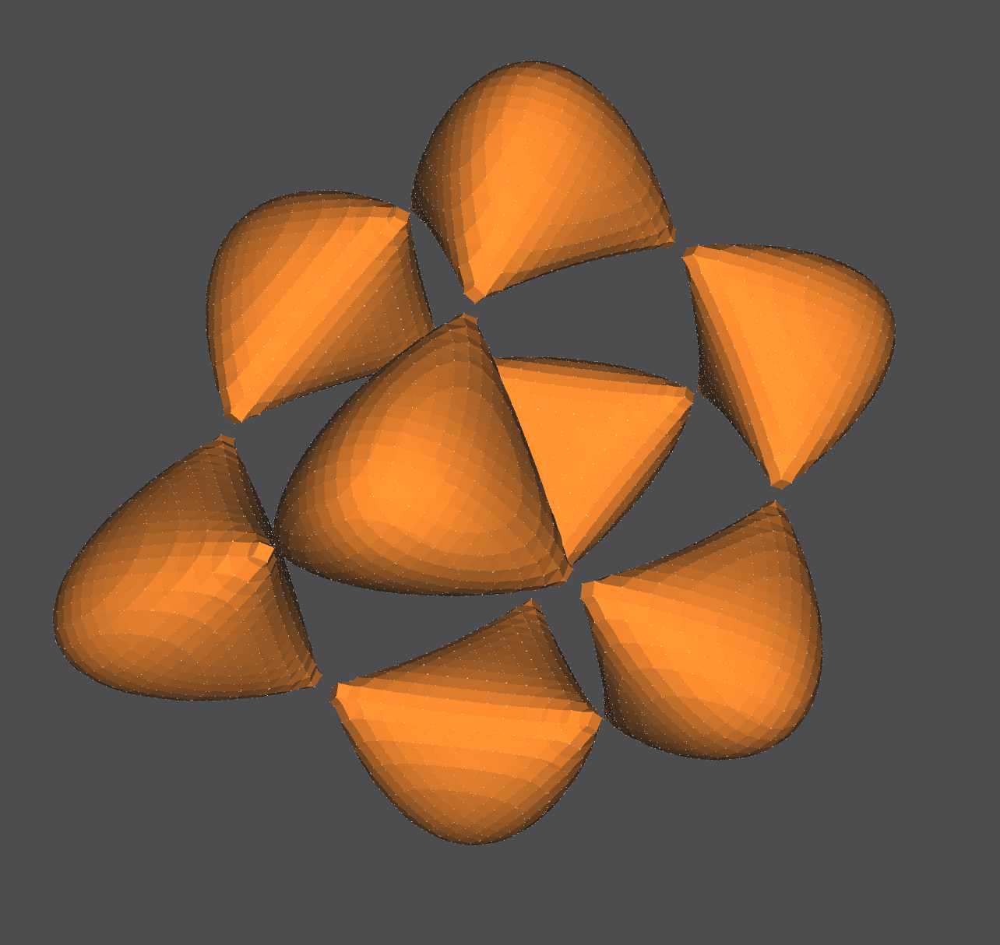

## A Dive into NOME3: The Non-Orientable Manifold Editor

NOME3 (Non-Orientable Manifold Editor) is an emerging new Computer-Aided-Design tool being developed by [Professor Carlo Sequin](https://people.eecs.berkeley.edu/~sequin/) and a team of undergraduate and graduate researchers at the University of California, Berkeley. It is specifically built to assist in the design of smooth but precise free-form geometries, such as those by artists like [Eva Hild](https://www.evahild.com/ceramics) or [Charles O. Perry](http://www.charlesperry.com/).

The project is built using C++ as the backend, with a proprietary [NOME language](https://github.com/randyfan/NOME3/wiki/NOME3-Language-Reference) used as the medium in which users can build their creations. The main up-to-date GitHub repository for the NOME3 Project, along with compilation and usage instructions, can be found [here](https://github.com/randyfan/NOME3).

Table of Contents
=================
**Featured Section**
* [**Generator: General Implicit Surface**](#generator-general-implicit-surface)

**All Sections**
* [How does NOME3 work?](#how-does-nome3-work)
* [My Contributions to the NOME3 Project](#my-contributions-to-the-nome3-project)
  * [Stress Test: Fractal Design](#stress-test-fractal-design)
  * [Stress Test: Klein Bottle](#stress-test-klein-bottle)
  * [Generator: Sphere](#generator-sphere)
  * [Generator: Mobius Strip](#generator-mobius-strip)
  * [Generator: Hyperboloid](#generator-hyperboloid)
  * [Generator: General Cartesian Surface](#generator-general-cartesian-surface)
  * [Generator: General Parametric Surface](#generator-general-parametric-surface)
  * [Generator: General Implicit Surface](#generator-general-implicit-surface)
* [About](#about)

## How does NOME3 work?

### Introduction
The NOME proprietary language is built around specifying meshes, groups, and instances. Meshes and groups can be turned into instances, which are then displayed on the UI.

A mesh is any basic generator that is defined within NOME3. These basic generators can be found [here](https://github.com/randyfan/NOME3/wiki/NOME3-Language-Reference), and can be combined in order to create more advanced and geometrically complicated shapes. Basic generators have parameters that further specify their shape and look, which allows for more flexibility in design. A call to a generator takes the form:
```markdown
generator name_of_generator (condition_1 condition_2 ...) endgenerator
```

A group is a number of meshes that have been 'grouped' together into a new mesh, that can then be treated as a singular mesh and have operations performed on. This allows for scalability in the design of more complicated shapes.

An instance of either a mesh or a group is created in order to actually bring an object into the scene. Instances of meshes or groups must be created in order for the mesh or group to be displayed. Multiple instances of the same mesh or group can also be created.

Further operations such as point selection, face deletion, line sweeps, subdivision, screen panning and rotation, etc.) can then be performed once the scene is loaded.

The project must be compiled using CMake, with compilation instructions found [here](https://github.com/randyfan/NOME3/blob/master/README.md). To use the compiled application, open the program and load in a .NOM file. The scene in the .NOM file will be rendered into the crystal-ball interface, which can then be interacted with.

Generators and more-complex shapes (ex. sweeps, combinations of generators, etc.) must be defined and instantiated on the .NOM file prior to rendering in the application, but once a scene is rendered then faces/vertices can be deleted, objects can be subdivided, the time variable can be used to pan the screen, etc.

### NOME Language Example
An example of the interplay between meshes, groups, and instances can be seen here:
```markdown
point p1 (0 2 1) endpoint
point p2 (1 0 1) endpoint
point p3 (-1 0 1) endpoint

mesh triangle
    face f1 (p1 p2 p3) endface
endmesh

group diamond
	instance t0 triangle endinstance
	instance t1 triangle rotate (0 1 0) (90) translate (-1 0 1) endinstance
	instance t2 triangle rotate (0 0 1) (180) endinstance
	instance t3 triangle rotate (0 0 1) (180) rotate (0 1 0) (90) translate (-1 0 1) endinstance
endgroup

instance d1 diamond scale (25 25 25) translate (0 0 -25) endinstance
```

### Built in C++
Generators in the NOME3 Project are built in C++. OpenMesh points and faces are used as the underlying data structures, and ANTLR4 is used to define and parse the proprietary NOME Language.

An example of a typical Generator File in C++:
```cpp
DEFINE_META_OBJECT(CMobiusStrip)
{
    BindPositionalArgument(&CMobiusStrip::N, 1, 0);
    BindPositionalArgument(&CMobiusStrip::Radius, 1, 1);
    BindPositionalArgument(&CMobiusStrip::NumTwists, 1, 2);
    BindPositionalArgument(&CMobiusStrip::NumCuts, 1, 3);
}

void CMobiusStrip::UpdateEntity()
{
    if (!IsDirty())
        return;

    Super::UpdateEntity();

    // load in arguments to Mobius Strip generator
    float n = (float)N.GetValue(100.0f); // number of individual points on each band
    float radius = (float)Radius.GetValue(1.0f); // total radius
    int numTwists = (int)ceil(NumTwists.GetValue(1.0f)); // number of twists
    int numCuts = (int)ceil(NumCuts.GetValue(0.0f)); // number of times surface is cut
    float bandwidth = 2*radius/((numCuts*2) + 1); // radius of each band

    // create vertices
    float uIncrement = (1.0f/n)*(float)tc::M_PI;
    int uCounter = 0;
    for (float u = 0.0f; u < 2.f * (float)tc::M_PI + uIncrement/3; u += uIncrement)
    { // uIncrement/3 allows n+1 total vertices, accounting for rounding error (n+1th vertex == 0th vertex)
        int vCounter = 0;
        for (float v = -1*radius; v <= radius + bandwidth/3; v += bandwidth)
        { // bandwidth/3 accounts for rounding error
            float x = (1+(v/2.0f)*cosf((numTwists*u)/2.0f))*cosf(u);
            float y = (1+(v/2.0f)*cosf((numTwists*u)/2.0f))*sinf(u);
            float z = (v/2.0f)*sinf((numTwists*u)/2.0f);
            AddVertex("v_" + std::to_string(uCounter) + "_" + std::to_string(vCounter), // name ex. "v_0_5"
                      { x, y, z } );


            AddVertex("vt_" + std::to_string(uCounter) + "_" + std::to_string(vCounter), // name ex. "vt_0_5"
                      { x, y, z + (radius/10) } );

            vCounter++;
        }
        uCounter++;
    }

    // add faces
    for (int uFaceCounter = 0; uFaceCounter + 1 < uCounter; uFaceCounter++)
    {
        for (int cut = 0; cut <= numCuts; cut++)
        {
            std::vector<std::string> face;
            face.push_back("v_" + std::to_string(uFaceCounter) + "_" + std::to_string(2*cut)); //2*cut
            face.push_back("v_" + std::to_string(uFaceCounter + 1) + "_" + std::to_string(2*cut));
            face.push_back("v_" + std::to_string(uFaceCounter + 1) + "_" + std::to_string(2*cut+1)); //2*cut+1
            face.push_back("v_" + std::to_string(uFaceCounter) + "_" + std::to_string(2*cut+1));
            AddFace("f1_" + std::to_string(uFaceCounter) + "_" + std::to_string(cut), face);

            std::vector<std::string> facet;
            facet.push_back("vt_" + std::to_string(uFaceCounter) + "_" + std::to_string(2*cut)); //2*cut
            facet.push_back("vt_" + std::to_string(uFaceCounter + 1) + "_" + std::to_string(2*cut));
            facet.push_back("vt_" + std::to_string(uFaceCounter + 1) + "_" + std::to_string(2*cut+1)); //2*cut+1
            facet.push_back("vt_" + std::to_string(uFaceCounter) + "_" + std::to_string(2*cut+1));
            AddFace("ft1_" + std::to_string(uFaceCounter) + "_" + std::to_string(cut), facet);

            std::vector<std::string> faceconnect1;
            faceconnect1.push_back("v_" + std::to_string(uFaceCounter) + "_" + std::to_string(2*cut));
            faceconnect1.push_back("v_" + std::to_string(uFaceCounter + 1) + "_" + std::to_string(2*cut));
            faceconnect1.push_back("vt_" + std::to_string(uFaceCounter + 1) + "_" + std::to_string(2*cut));
            faceconnect1.push_back("vt_" + std::to_string(uFaceCounter) + "_" + std::to_string(2*cut));
            AddFace("fc1_" + std::to_string(uFaceCounter) + "_" + std::to_string(cut), faceconnect1);

            std::vector<std::string> faceconnect2;
            faceconnect2.push_back("v_" + std::to_string(uFaceCounter) + "_" + std::to_string(2*cut+1));
            faceconnect2.push_back("v_" + std::to_string(uFaceCounter + 1) + "_" + std::to_string(2*cut+1));
            faceconnect2.push_back("vt_" + std::to_string(uFaceCounter + 1) + "_" + std::to_string(2*cut+1));
            faceconnect2.push_back("vt_" + std::to_string(uFaceCounter) + "_" + std::to_string(2*cut+1));
            AddFace("fcc1_" + std::to_string(uFaceCounter) + "_" + std::to_string(cut), faceconnect2);
        }
    }
}
```

## My Contributions to the NOME3 Project

### Stress Test: Fractal Design
There are many steps that the NOME3 application goes through in order to generate an image. Upon loading in a file, NOME3 will parse the NOME language files and call the correct generator classes, create and calcualte the position of underlying OpenMesh points and faces, update with user-specified settings, and then draw them into the scene. This is very resource-intensive, and as such NOME3 is prone to crashes.

My first task was to build a stress test model in order to test the capabilities of the rendering packages that NOME3 uses. My design was 3 recursive repetitions of 3-dimensional diamonds made up of triangle instances surrounded by four toruses. This fractal display was built entirely using the NOME proprietary language.

#### The scene


#### Fractal Design
The alternate viewing angle and zoom-in makes the recursive design of the 'fractal' shape more obvious. It becomes easier to notice that the fractal is 3 levels deep, with the smallest fractal missing the 2 tori surrounding the diamonds (due to performance frames-per-second reasons).


The NOM file containing the code can be found [here](https://github.com/Brandonyli/brandonyli.github.io/blob/main/media/hw1.nom).

### Stress Test: Klein Bottle
A Klein Bottle is a 2-dimensional manifold that has a non-orientable surface in 3-dimensions. The Klein Bottle is interesting because the surface has no boundary (like a sphere), and instead the 'spout' of the bottle wraps into itself and creates a tunnel at the bottom of the 'bottle'. This Klein Bottle was built entirely using the NOME proprietary language, with a Python Notebook script generating the NOME language lines.

#### The Scene

{:height="60%" width="60%"}

#### The Spout and Bottom
{:height="60%" width="60%"}

The bottom of the bottle has black-colored faces, which is a pecularity of the OpenMesh software in NOME3. Fear not, it is one continuous surface.
{:height="60%" width="60%"}

#### NOM Code Example
This code was generated using a [Python Notebook](https://github.com/Brandonyli/brandonyli.github.io/blob/main/media/NOME%20File%20Generator%20Example.ipynb) and exported to a NOM file.
````markdown
mesh m
point pt_0_0 (4.0 -0.0 0.0) endpoint
point pt_0_1 (3.95075 -0.0 0.62574) endpoint
point pt_0_2 (3.80423 -0.0 1.23607) endpoint
point pt_0_3 (3.56403 -0.0 1.81596) endpoint
point pt_0_4 (3.23607 -0.0 2.35114) endpoint
point pt_0_5 (2.82843 -0.0 2.82843) endpoint
point pt_0_6 (2.35114 -0.0 3.23607) endpoint
.
.
.
face face_0_0 (pt_0_0 pt_1_0 pt_1_1 pt_0_1) endface
face face_0_1 (pt_0_1 pt_1_1 pt_1_2 pt_0_2) endface
face face_0_2 (pt_0_2 pt_1_2 pt_1_3 pt_0_3) endface
face face_0_3 (pt_0_3 pt_1_3 pt_1_4 pt_0_4) endface
face face_0_4 (pt_0_4 pt_1_4 pt_1_5 pt_0_5) endface
face face_0_5 (pt_0_5 pt_1_5 pt_1_6 pt_0_6) endface
face face_0_6 (pt_0_6 pt_1_6 pt_1_7 pt_0_7) endface
.
.
.
endmesh

instance m1 m endinstance
````

The NOM file containing the code can be found [here](https://github.com/Brandonyli/brandonyli.github.io/blob/main/media/kleinbottle.nom), with accompanying [.ipynb file](https://github.com/Brandonyli/brandonyli.github.io/blob/main/media/NOME%20File%20Generator%20Example.ipynb).

### Generator: Sphere
Generators are classes written in C++ mainly utilizing the OpenMesh package, which are called by the NOME proprietary language (by instantiating meshes and instances) in order to draw surfaces into the scene. Generators have various parameters that can be passed into them which control the shape and look of the output surface.

This is my generator for a sphere, which was built in C++. It takes in 5 parameters that control the sphere's number of segments, radius, cut, etc.

#### The Scene

{:height="60%" width="60%"}
{:height="60%" width="60%"}
{:height="60%" width="60%"}

The NOM file containing the C++ generator files and an example NOM file can be found [here](https://github.com/Brandonyli/brandonyli.github.io/tree/main/sphere).

### Generator: Mobius Strip
A basic Mobius Strip is a 1-sided surface in 3 dimensions with one boundary curve. It is considered the simplest non-orientable surface. Mobius Strips can have cuts parallel to the boundary curve (which increases the number of boundary curves in a Mobius Strip), and can also have more than one twist. The thickness of the mobius strip is proportional to the radius.

My generator for a Mobius Strip, built in C++, takes in 4 parameters that control the Mobius Strip's number of segments, radius, number of twists, and number of cuts.

#### The Scene

The black and orange surfaces are the same 1-sided surface, but the OpenMesh package always defines both a front (orange) and back (black) side to a surface. In this case, since the front and back are the same surface they end up touching and looking like that.

{:height="60%" width="60%"}
{:height="60%" width="60%"}

The bottom right corner has seemingly misaligned black-to-yellow faces, which is because of NOME3's face-coloring limitations (NOME3 needs to identify a front and back to a face, but a mobius strip is one continuous face. It is correctly generated, with the front and back face colors meeting at that corner.
{:height="60%" width="60%"}

The NOM file containing the C++ generator files and an example NOM file can be found [here](https://github.com/Brandonyli/brandonyli.github.io/tree/main/mobiusstrip).

### Generator: Hyperboloid
A hyperboloid is the surface that is generated when you rotate a 2-dimensional hyperbola in 3 dimensions, along a principal axis. It is considered a quadric surface with a center of symmetry, and any cut on the hyperboloid results in a 2-dimensional hyperbola. A hyperboloid can have either 1 sheet or 2 sheets which define whether its shape is one continuous tunnel, a paraboloid, or two paraboloids.

My generator for a Hyperboloid, built in C++, takes in 6 parameters that control the constants in the hyperboloid formula that define its shape, size and number of segments, and the number of sheets.

#### The Scene
The generator supports hyperboloid of 1 sheet and 2 sheets.
{:height="60%" width="60%"}
{:height="60%" width="60%"}
{:height="60%" width="60%"}

The NOM file containing the C++ generator files and an example NOM file can be found [here](https://github.com/Brandonyli/brandonyli.github.io/tree/main/hyperboloid).

### Generator: General Cartesian Surface
The general cartesian surface generator takes in any function in the form of z(x,y), along with parameters specifying the range and number of segments of x and y. This function can draw any mathematical surface that can be defined as z in terms of x and y. The parametric version of this generator can draw parametric surfaces, and can create easily surfaces like the hyperboloid, mobius strip, etc. that are defined using parametric equations.

This generator was tricky to implement because creating a generator that would take in any mathematical function necessitated changes to the proprietary NOME language. This required understanding ANTLR4, as well as how the language gets lexed and parsed in the NOME3 Project before reaching the generator. The language changes also needed to be stable so that the calling of meshes, groups, instances, and other generators were not affected.

Functions are passed into this generator by "naming" the object as the function itself in the NOM file. This quirk allows the ANTLR parser to pass in the raw function as a std::String to the General Cartesian Surface C++ class, which then parses it into a mathematical formula, before outputting the corresponding points and faces. Functions must also be placed with quotations, see end of section for code examples.

My generator was written in C++, and takes in a function of form z(x,y) along with 4 parameters that define the function's range and number of segments in x and y.

#### The Scene


To decrease the jaggedness we could increase the number of segments defined for this surface.


#### NOM Code Example
````
gencartesiansurf "(7*x*y)/exp((x^2)+(y^2))" (-2 2 -2 2 40 40) endgencartesiansurf
instance example1 "(7*x*y)/exp((x^2)+(y^2))" endinstance

gencartesiansurf "((y^2)/1.5)-((x^2)/2)" (-3 3 -3 3 40 40) endgencartesiansurf
instance example2 "((y^2)/1.5)-((x^2)/2)" translate (12 0 0) endinstance

gencartesiansurf "sin(10(x^2+y^2))/10" (-3 3 -3 3 30 30) endgencartesiansurf
instance example3 "sin(10(x^2+y^2))/10" translate (-12 0 0) endinstance

gencartesiansurf "sin(5x)*cos(5y)/5" (-3 3 -3 3 30 30) endgencartesiansurf
instance example4 "sin(5x)*cos(5y)/5" translate (0 -12 0) endinstance
````

#### ANTLR4 Definitions
Adding the capability to accept functions of any general form required me to change language definitions in the ANTLR4 file. The code block below is a relevant sub-section of the ANTLR4 file that deals with lexing for the general function generator.
````
grammar Nom;

expression
   :  ident LPAREN expression RPAREN # Call
   |  op= (PLUS | MINUS) expression # UnaryOp
   |  expression op=POW expression # BinOp
   |  expression op=(TIMES | DIV)  expression # BinOp
   |  expression op=(PLUS | MINUS) expression # BinOp
   |  LPAREN expression RPAREN # SubExpParen
   |  beg='{' sec='expr' expression end='}' # SubExpCurly
   |  atom # AtomExpr
   ;
   
ident
   : IDENT
   ;
   
IDENT : VALID_ID_START VALID_ID_CHAR* | QUOTE VALID_ID_FUNC* QUOTE ;
fragment VALID_ID_START : ('a' .. 'z') | ('A' .. 'Z') | '_' | '.' ;
fragment VALID_ID_CHAR : VALID_ID_START | ('0' .. '9') ;
fragment VALID_ID_FUNC : VALID_ID_CHAR | '(' | ')' | '*' | '/' | '+' | '!' | '%' | '=' | '^' | '-' ;
fragment QUOTE : '"' ;

command
   : open='gencartesiansurf' name=ident LPAREN expression expression expression expression expression expression RPAREN end='endgencartesiansurf' # CmdExprListOne
   ;
````

The NOM file containing the C++ generator files, an example NOM file, and the edited NOM language file can be found [here](https://github.com/Brandonyli/brandonyli.github.io/tree/main/GenCartesianSurf).

### Generator: General Parametric Surface
The general parametric surface generator takes in 3 functions in the form of x(u,v), y(u,v), and z(u,v), along with parameters specifying the range and number of segments of u and v. This function can draw any mathematical surface that can be defined as 3 parametric equations.

Our three functions are passed in as the mesh's 'name', similar to the general cartesian surface generator. One difference is that since parametric surfaces have 3 equations, they are passed in as x(u,v), y(u,v), and z(u,v), separated by a bar delimiter and surrounded by quotes.

There are 4 parameters that define the function's range and number of segments in u and v.

#### The Scene

A 'lumpy sphere' surface, the equations are similar to a sphere with a few extra sinusoidal functions and constants.


One sphere is generated using the sphere generator, the other using the parametric surface generator. Can you tell which is which?


Here are two dupins with different constants defined in their equations.


This (2-3) Torus Knot is generated using only 1 parameter t, rather than two parameters u,v.


This seashell looks black because the points are being generated and connected into faces in a clockwise manner, while OpenMesh expects faces to be created in a counter-clockwise manner.


Setting x'(u,v)=-x(u,v), y'(u,v)=-y(u,v), z'(u,v)=-z(u,v) gives us the correct counter-clockwise face declaration.


#### NOM Code Example
````
genparametricsurf "(0.5*(0.4-1*cos(u)*cos(v))+0.96*cos(u))/(1-0.4*cos(u)*cos(v))|(0.98*sin(u)*(1-0.5*cos(v)))/(1-0.4*cos(u)*cos(v))|(0.98*sin(v)*(0.4*cos(u)-0.5))/(1-0.48*cos(u)*cos(v))" (0 6.28318 0 6.28318 60 60) endgenparametricsurf
instance dupin1 "(0.5*(0.4-1*cos(u)*cos(v))+0.96*cos(u))/(1-0.4*cos(u)*cos(v))|(0.98*sin(u)*(1-0.5*cos(v)))/(1-0.4*cos(u)*cos(v))|(0.98*sin(v)*(0.4*cos(u)-0.5))/(1-0.48*cos(u)*cos(v))" translate (6 0 0) endinstance

genparametricsurf "(sin(5*u)*cos(5*v)+4)*(cos(u)*sin(v)/4)|(sin(5*u)*cos(5*v)+4)*(sin(u)*sin(v))/4|(sin(5*u)*cos(5*v)+4)*(cos(v)/4)" (-3.14159 3.14159 -3.14159 0 100 100) endgenparametricsurf
instance lumpysphere "(sin(5*u)*cos(5*v)+4)*(cos(u)*sin(v)/4)|(sin(5*u)*cos(5*v)+4)*(sin(u)*sin(v))/4|(sin(5*u)*cos(5*v)+4)*(cos(v)/4)" translate (-6 0 0) endinstance

genparametricsurf "sin(v)*(2+cos(3*u))*cos(2*u)|sin(v)*(2+cos(3*u))*sin(2*u)|sin(v)*cos(v)*(sin(3*u))" (0 6.28318 0 1.0472 60 20) endgenparametricsurf
instance tknot23 "sin(v)*(2+cos(3*u))*cos(2*u)|sin(v)*(2+cos(3*u))*sin(2*u)|sin(v)*cos(v)*(sin(3*u))" translate (0 -6 0) endinstance

genparametricsurf "-((5/4)*(1-(v/6.28318530718))*cos(2*v)*(1+cos(u))+cos(2*v))|-((5/4)*(1-(v/6.28318530718))*sin(2*v)*(1+cos(u))+sin(2*v))|-(((10*v)/6.28318530718)+(5/4)*(1-(v/6.28318530718))*sin(u)+15)" (0 6.28318 -6.28318 6.28318 50 50) endgenparametricsurf
instance seashell "-((5/4)*(1-(v/6.28318530718))*cos(2*v)*(1+cos(u))+cos(2*v))|-((5/4)*(1-(v/6.28318530718))*sin(2*v)*(1+cos(u))+sin(2*v))|-(((10*v)/6.28318530718)+(5/4)*(1-(v/6.28318530718))*sin(u)+15)" endinstance
````

#### Generator C++ Code Guide
The general Cartesian and Parametric surface generators are different that the fixed shape generators because they take in a mathematical function stored as a std::string and use the package [ExprTK](https://github.com/ArashPartow/exprtk) to parse and translate the string into an object that generates outputs to the mathematical function.

We begin by binding the arguments that are passed into our CGenParametricSurf class object. These parameters specify the range and number of segments (along the range) of the non-fixed variables u and v. The UpdateEntity() method is the main method that generates our surface. The code following this code block are all within our main UpdateEntity() method.
````cpp
DEFINE_META_OBJECT(CGenParametricSurf)
{
    BindPositionalArgument(&CGenParametricSurf::u_start, 1, 0);
    BindPositionalArgument(&CGenParametricSurf::u_end, 1, 1);
    BindPositionalArgument(&CGenParametricSurf::v_start, 1, 2);
    BindPositionalArgument(&CGenParametricSurf::v_end, 1, 3);
    BindPositionalArgument(&CGenParametricSurf::u_segs, 1, 4);
    BindPositionalArgument(&CGenParametricSurf::v_segs, 1, 5);
}

void CGenParametricSurf::UpdateEntity()
{
...
}
````

We must define our arguments as variables in order to use them.
````cpp
double uStart = (double)u_start.GetValue(0.0f);
double uEnd = (double)u_end.GetValue(0.0f);
double vStart = (double)v_start.GetValue(0.0f);
double vEnd = (double)v_end.GetValue(0.0f);
double uSegs = (double)u_segs.GetValue(0.0f);
double vSegs = (double)v_segs.GetValue(0.0f);
````

In this code block we clean our input string 'funcConcat' and split it into 3 strings, funcX for our X-dimension, funcY for our Y-dimension, and funcZ for our Z-dimension.
````cpp
std::string funcConcat = this->GetName(); // ex. funcConcat := x(u,v)|y(u,v)|z(u,v) = "cos(u)*sin(v)|sin(u)*sin(v)|cos(v)"
funcConcat.erase(std::remove(funcConcat.begin(), funcConcat.end(), '"'), funcConcat.end());
size_t numFuncsInString = std::count(funcConcat.begin(), funcConcat.end(), '|');

std::vector<std::string> tokens;
std::string token;
std::istringstream tokenStream(funcConcat);
while (std::getline(tokenStream, token, '|')) {
tokens.push_back(token);
}
std::string funcX = tokens[0];
std::string funcY = tokens[1];
std::string funcZ = tokens[2];
````

This code block contains our calls to [ExprTK](https://github.com/ArashPartow/exprtk) methods. ExprTK allows us to pass in our 3 strings and get 'mathematical function' objects in return. The symbol table registerd our non-fixed symbols u and v, and allows us to change their values on the fly. The expression_t objects are the objects we call in order to calculate our function at a given u and v. The parser parses the strings into their respective expression objects.
````cpp
typedef exprtk::symbol_table<double> symbol_table_t;
typedef exprtk::expression<double>     expression_t;
typedef exprtk::parser<double>             parser_t;

double u = 0.0;
double v = 0.0;

// Register symbols with the symbol_table
symbol_table_t symbol_table;
symbol_table.add_variable("u",u);
symbol_table.add_variable("v",v);

// Instantiate expressions and register symbol_table
expression_t expression_x;
expression_x.register_symbol_table(symbol_table);
expression_t expression_y;
expression_y.register_symbol_table(symbol_table);
expression_t expression_z;
expression_z.register_symbol_table(symbol_table);

// Instantiate parsers and compile the expression
parser_t parser_x;
parser_x.compile(funcX,expression_x);
parser_t parser_y;
parser_y.compile(funcY,expression_y);
parser_t parser_z;
parser_z.compile(funcZ,expression_z);
````

This final block contains two loops, one to define vertex points for our surface and one to define faces from those vertex points. The smoothness (i.e. number of vertex points and faces generated) is dependent on the segment arguments we passed into the method. We can evaluate our math expression object (expression_x, expression_y, expression_z) at a given point (u,v) by setting 'u = ui' and 'v = vi', before calling the value() method attribute on our expression objects.

Once vertices and faces are created, they are passed into our rendering engine to be displayed on the GUI.
````cpp
// set increment size
double uIncrement = (uEnd - uStart) / uSegs;
double vIncrement = (vEnd - vStart) / vSegs;

// add points to vector
double xi = 0.0;
double yi = 0.0;
double zi = 0.0;
int uCounter = 0;
int vCounter = 0;
for (double ui = uStart; ui <= uEnd + (uIncrement/5); ui += uIncrement) { // dividing by 5 for rounding error
u = ui;
vCounter = 0;
	for (double vi = vStart; vi <= vEnd + (vIncrement/5); vi += vIncrement) { // dividing by 5 for rounding error
	    v = vi;
	    xi = expression_x.value();
	    yi = expression_y.value();
	    zi = expression_z.value();
	    AddVertex("v_" + std::to_string(uCounter) + "_" + std::to_string(vCounter), // name ex. "v_0_5"
		      { (float)xi, (float)yi, (float)zi } );
	    vCounter++;
	}
uCounter++;
}

// add faces
int faceCounter = 0;
for (int ui = 0; ui + 1 < uCounter; ui++) {
	for (int vi = 0; vi < vCounter - 1; vi++) {
	    std::vector<std::string> face;
	    face.push_back("v_" + std::to_string(ui) + "_" + std::to_string(vi));
	    face.push_back("v_" + std::to_string(ui+1) + "_" + std::to_string(vi));
	    face.push_back("v_" + std::to_string(ui+1) + "_" + std::to_string(vi+1));
	    face.push_back("v_" + std::to_string(ui) + "_" + std::to_string(vi+1));

	    AddFace("f1_" + std::to_string(faceCounter++), face);
	}
}
````

The NOM file containing the C++ generator files, an example NOM file, and the edited NOM language file can be found [here](https://github.com/Brandonyli/brandonyli.github.io/tree/main/GenParametricSurf).

### Generator: General Implicit Surface
Implicit surfaces are defined by f(x,y,z)=b, where b is the 'isolevel'. Implicit surfaces can be thought of as Euclidean surfaces in 4 dimensions, projected down into 3 dimensions. They are fundamentally different than explicit functions like the functions supplied to the Cartesian Surface generator described in an earlier section, which take the form z=f(x,y).

The generation of implicit surfaces can be thought of as solving g(c)=f(X,Y,c)-b, where a scalar c is plugged into the function g and evaluated at every infinitesimally small point on the X-Y plane. We then calculate Z=g(c)+c (our function g(c) is evaluated across the X-Y plane, so Z is a matrix that describes the z-dimension, i.e. the 'height' of our function in the z-direction). We evaluate Z(c)=g(c)+c at every level of z from -inf to inf, effectively giving us identical surfaces stacked on top of each other (see image below).

{:height="60%" width="60%"}

For each layer we want to select points on these surfaces that have their height in the z-dimension equal to our input c, which can be thought of as running an invisible plane across each of our surfaces and displaying only the points that lie on the plane.

{:height="60%" width="60%"}

By doing this iterative process at every level of z from -inf to inf, we identify the points that give us an outline of our implicit surface.

{:height="60%" width="60%"}

#### Marching Cubes
After generating these points we still have a problem: we can calculate points that lie on the implicit surface at every level in our z-dimension, but we don't have a good way to link the layers together. This problem leads us to a different approach to generating these surfaces, the [Marching Cubes Algorithm](https://en.wikipedia.org/wiki/Marching_cubes).

Without going into too much detail, the Marching Cubes Algorithm essentially splits the Euclidian 3-dimensional space that the implicit surface lies in into a 3D grid of equal sized cubes. We define an algorithm that iteratively 'marches' along all the cubes, at each point calculating whether each of the 8 vertex points of the cube lies inside or outside the implicit surface. Depending on the number of vertex points inside of the surface, we generate a different triangle face that represents what the surface's plane running through that cube might look like. Since we have 8 vertices, we have 2^8 (256) possible representations of the surface running through that cube.

We then display the triangle faces to generate our implicit surface image. To get a more precise image we increase the number of cubes inside of the grid that we're evaluating. We also use a linear interpolation algorithm across adjacent cubes to 'average' the faces leading to smoother surface. A visual aid video of the algorithm can be found [here](https://www.youtube.com/watch?v=B_xk71YopsA&t=18s).

Here is an example of the triangle faces generated by the Marching Cubes Algorithm:
{:height="60%" width="60%"}

#### The Scene
Two Goursat Tangles at different isolevels
{:height="80%" width="80%"}
{:height="80%" width="80%"}

Two Entzensberger Stars at different isolevels
{:height="80%" width="80%"}

A BC8 surface in the foreground, and a cosine segment surface in the background
{:height="80%" width="80%"}

A BC8 surface at another isolevel
{:height="80%" width="80%"}

Another surface in the BCn family, at different isolevels
{:height="80%" width="80%"}
{:height="80%" width="80%"}

A layered-sinusoidal surface
{:height="80%" width="80%"}

This generator can also plot implicit surfaces that rely on some condition, by using an if statement
```
genimplicitsurf "if((x^2+y^2+z^2<35),2-(cos(x+(1+sqrt(5))/2*y)+cos(x-(1+sqrt(5))/2*y)+cos(y+(1+sqrt(5))/2*z)+cos(y-(1+sqrt(5))/2*z)+cos(z-(1+sqrt(5))/2*x)+cos(z+(1+sqrt(5))/2*x)),1)" (-5.5 5.5 -5.5 5.5 -5.5 5.5 60) endgenimplicitsurf
instance wow "if((x^2+y^2+z^2<35),2-(cos(x+(1+sqrt(5))/2*y)+cos(x-(1+sqrt(5))/2*y)+cos(y+(1+sqrt(5))/2*z)+cos(y-(1+sqrt(5))/2*z)+cos(z-(1+sqrt(5))/2*x)+cos(z+(1+sqrt(5))/2*x)),1)" endinstance
```
{:height="80%" width="80%"}

```
genimplicitsurf "if((x^2+y^2>0.05)and(x+y+z>-1),(x^8+y^30+z^8-(x^4+y^50+z^4-0.3))*(x^2+y^2+z^2-0.5),1)" (-2 2 -2 2 -2 2 50) endgenimplicitsurf
instance altar "if((x^2+y^2>0.05)and(x+y+z>-1),(x^8+y^30+z^8-(x^4+y^50+z^4-0.3))*(x^2+y^2+z^2-0.5),1)" translate (-20 -20 -20) endinstance
```
{:height="80%" width="80%"}

An implicit surface made using a nested if statement.
```
genimplicitsurf "if(x>1,x^2+y^2+z^2-16,if(x>-1,x^2+y^2+z^2-9,x^2+y^2+z^2-4))" (-4 4 -4 4 -4 4 60) endgenimplicitsurf
instance nestedcircles "if(x>1,x^2+y^2+z^2-16,if(x>-1,x^2+y^2+z^2-9,x^2+y^2+z^2-4))" endinstance
```

{:height="80%" width="80%"}

#### NOM Code Example
```
genimplicitsurf "(x^4)+(y^4)+(z^4)+(-5)*((x^2)+(y^2)+(z^2))+11.8" (-3 3 -3 3 -3 3 30) endgenimplicitsurf
instance goursatTangle "(x^4)+(y^4)+(z^4)+(-5)*((x^2)+(y^2)+(z^2))+11.8" endinstance

genimplicitsurf "x^4+y^4+z^4-x^2-y^2-z^2+0.5" (-2 2 -2 2 -2 2 30) endgenimplicitsurf
instance chubbs "x^4+y^4+z^4-x^2-y^2-z^2+0.5" translate (5 0 0) endinstance
```

#### Generator C++ Code Guide
Inspiration and starter code for the Marching Cubes Algorithm is from Paul Bourke's C++ implementation found [here](http://paulbourke.net/geometry/polygonise/). Inspiration and starter code for combining the Marching Cubes Algorithm with ExprTk is from Pablo Javier Antuna's [TriangSurf](http://w3.impa.br/~pabloant/triangulation-surfaces.html) program.

Definition of structures used in main functions
```cpp
typedef exprtk::symbol_table<double> symbol_table_t;
typedef exprtk::expression<double> expression_t;
typedef exprtk::parser<double> parser_t;

typedef struct{
    double x, y, z;
}Xyz;

typedef struct{
    int p[3];
}Triangle;

typedef struct{
    Xyz p[8];
    double val[8];
}Gridcell;
```

Here we retrieve the implicit surface function as a std::string and set up the mathematical expression object. We then call runMarchingCubes that does the rest of the work.
```cpp
std::string funcStr = this->GetName(); // ex. funcStr := z(x,y) = "(x^4)+(y^4)+(z^4)+(-5)*((x^2)+(y^2)+(z^2))+11.8"
funcStr.erase(std::remove(funcStr.begin(), funcStr.end(), '"'), funcStr.end());


// Register symbols with the symbol_table
this->symbol_table.add_constants();
this->symbol_table.create_variable("x");
this->symbol_table.create_variable("y");
this->symbol_table.create_variable("z");
this->expression.register_symbol_table(this->symbol_table);

// Instantiate parser and compile the expression
parser_t parser;
parser.compile(funcStr,this->expression);


// runs marching cube algo and then creates vertices & faces
runMarchingCubes(numSegs, xStart, yStart, zStart, xEnd, yEnd, zEnd);
```

The function runMarchingCubes calculates the cube vertices on the 3-dimensional grid that we run the Marching Cubes algorithm on. 
```cpp
void CGenImplicitSurf::runMarchingCubes(int gridSize,
                                            double xMin, double yMin, double zMin,
                                            double xMax, double yMax, double zMax)
{
    double deltaX = (xMax-xMin)/((double)(gridSize-1));
    double deltaY = (yMax-yMin)/((double)(gridSize-1));
    double deltaZ = (zMax-zMin)/((double)(gridSize-1));

    Gridcell grid;
    std::vector <Xyz> vertex(15);
    std::vector <Triangle> Triangles(10);
    int count[2] = {0,0};

    for (int i = 0; i<gridSize; i++){
        grid.p[0].x = xMin + i*deltaX; grid.p[1].x = xMin + (i+1)*deltaX; grid.p[2].x = xMin +(i+1)*deltaX; grid.p[3].x = xMin +i*deltaX;
        grid.p[4].x = xMin +i*deltaX; grid.p[5].x = xMin +(i+1)*deltaX; grid.p[6].x = xMin +(i+1)*deltaX; grid.p[7].x = xMin +i*deltaX;
        for (int j = 0; j<gridSize; j++){
            grid.p[0].y = yMin +j*deltaY; grid.p[1].y = yMin +j*deltaY; grid.p[2].y = yMin +(j+1)*deltaY; grid.p[3].y =yMin + (j+1)*deltaY;
            grid.p[4].y =yMin + j*deltaY; grid.p[5].y = yMin +j*deltaY; grid.p[6].y =yMin + (j+1)*deltaY; grid.p[7].y = yMin +(j+1)*deltaY;
            for (int k = 0; k<gridSize; k++){

                grid.p[0].z =zMin + k*deltaZ; grid.p[1].z = zMin +k*deltaZ; grid.p[2].z = zMin +k*deltaZ; grid.p[3].z = zMin +k*deltaZ;
                grid.p[4].z = zMin +(k+1)*deltaZ; grid.p[5].z = zMin +(k+1)*deltaZ; grid.p[6].z =zMin + (k+1)*deltaZ; grid.p[7].z =zMin + (k+1)*deltaZ;

                grid.val[0] = functionXyz(grid.p[0].x, grid.p[0].y, grid.p[0].z);
                grid.val[1] = functionXyz(grid.p[1].x, grid.p[1].y, grid.p[1].z);
                grid.val[2] = functionXyz(grid.p[2].x, grid.p[2].y, grid.p[2].z);
                grid.val[3] = functionXyz(grid.p[3].x, grid.p[3].y, grid.p[3].z);
                grid.val[4] = functionXyz(grid.p[4].x, grid.p[4].y, grid.p[4].z);
                grid.val[5] = functionXyz(grid.p[5].x, grid.p[5].y, grid.p[5].z);
                grid.val[6] = functionXyz(grid.p[6].x, grid.p[6].y, grid.p[6].z);
                grid.val[7] = functionXyz(grid.p[7].x, grid.p[7].y, grid.p[7].z);

                polygonise(grid, vertex, Triangles, count);
            }
        }
    }

    int nv = count[0];
    int nt = count[1];

    addVerticesAndFaces(vertex, Triangles, nv, nt);
    return;
}
```

The following functions are called within addMarchingCubes.

The function functionXyz is called to calculate the value from the implicit function for each vertex on every cube.
```cpp
double CGenImplicitSurf::functionXyz(double x, double y, double z){
    this->symbol_table.get_variable("x")->ref() = x;
    this->symbol_table.get_variable("y")->ref() = y;
    this->symbol_table.get_variable("z")->ref() = z;

    return this->expression.value();
}
```

The function polygonize is then called to calculate the triangle faces on the object, and VertexInterp interpolates (smoothes) the faces.
```cpp
static int polygonise(Gridcell grid, std::vector <Xyz> &vertex, std::vector <Triangle> &Triangles, int cou[])
{
    int i,nTriang, nVertex;
    int cubeindex;
    int vertlist[12];

    int edgeTable[256]={
        0x0, 0x109, 0x203, 0x30a, ... }
    int triTable[256][16] =
        {{-1, -1, -1, -1, -1, -1, -1, -1, -1, -1, ...}}
	
    cubeindex = 0;
    if (grid.val[0] <= 0) cubeindex |= 1;
    if (grid.val[1] <= 0) cubeindex |= 2;
    if (grid.val[2] <= 0) cubeindex |= 4;
    if (grid.val[3] <= 0) cubeindex |= 8;
    if (grid.val[4] <= 0) cubeindex |= 16;
    if (grid.val[5] <= 0) cubeindex |= 32;
    if (grid.val[6] <= 0) cubeindex |= 64;
    if (grid.val[7] <= 0) cubeindex |= 128;

    /* Cube is entirely in/out of the surface */
    if (edgeTable[cubeindex] == 0)
        return 0;

    /* Find the vertices where the surface intersects the cube */
    nVertex = cou[0];
    if ((edgeTable[cubeindex] & 1) == 1){
        if (vertex.size() < nVertex+1 )
            vertex.resize( 2*vertex.size() );
        vertlist[0] = nVertex;
        vertex[nVertex] = VertexInterp(grid.p[0],grid.p[1],grid.val[0],grid.val[1],'X');
        nVertex++;
    }
    if ...
    
    /* Create the Triangle */
    nTriang = cou[1];
    i = 0;
    for (i=0;triTable[cubeindex][i]!=-1;i+=3) {
        if (Triangles.size() < nTriang+1 )
            Triangles.resize( 2*Triangles.size() );
        Triangles[nTriang].p[0] = vertlist[triTable[cubeindex][i+2  ]];
        Triangles[nTriang].p[1] = vertlist[triTable[cubeindex][i+1]];
        Triangles[nTriang].p[2] = vertlist[triTable[cubeindex][i]];
        nTriang++;
    }
    cou[1] = nTriang;

    return 1;
}


/*
   Linearly interpolate the position where an isosurface cuts
   an edge between two vertices, each with their own scalar value
*/
static Xyz VertexInterp(Xyz p1, Xyz p2, double valp1, double valp2, char type)
{
    double mu;
    Xyz p;

    if (type == 'X'){
        p.y = p1.y; p.z = p1.z;
        p.x = (p2.x*valp1-p1.x*valp2)/(valp1-valp2);
    }
    else if (type == 'Y'){
        p.x = p1.x; p.z = p1.z;
        p.y = (p2.y*valp1-p1.y*valp2)/(valp1-valp2);
    }
    else if (type == 'Z'){
        p.x = p1.x; p.y = p1.y;
        p.z = (p2.z*valp1-p1.z*valp2)/(valp1-valp2);
    }
    return(p);
}
```

Finally, we call addVerticesAndFaces to add the vertices and faces to the scene.
```cpp
void CGenImplicitSurf::addVerticesAndFaces(std::vector <Xyz> vertex, std::vector <Triangle> Triangles, int nv, int nt){
    for (int i = 0; i < nv; i++){
        AddVertex("v_" + std::to_string(i), // name ex. "v_0"
                  { (float)vertex[i].x, (float)vertex[i].y, (float)vertex[i].z } );
    }

    for (int i = 0; i < nt; i++){
        std::vector<std::string> face;
        face.push_back("v_" + std::to_string(Triangles[i].p[0]));
        face.push_back("v_" + std::to_string(Triangles[i].p[1]));
        face.push_back("v_" + std::to_string(Triangles[i].p[2]));

        AddFace("f_" + std::to_string(i), face); // name ex. "f_0"
    }
    return;
}
```

The NOM file containing the C++ generator files, an example NOM file, and the edited NOM language file can be found [here](https://github.com/Brandonyli/brandonyli.github.io/tree/main/GenImplicitSurf).


## About
{:height="40%" width="40%"}

[Brandon Lee](https://github.com/Brandonyli/brandonyli.github.io/tree/main/Resume) is a current 4th-year at UC Berkeley majoring in Data Science and minoring in Computer Science, with an emphasis in Economics. He has taken courses in Linear Algebra, Multivariable Calculus, Discrete Math, Probability Theory, Data Structures, Low-Level Programming, Database Systems, Algorithms, Cybersecurity, Machine Learning, Natural Language Processing, and Data Science Techniques.

Previous projects include RISC-V CPU design, NP-Hard Minimum Weighted Connected Dominating Set algorithm design, Database System design, and Neural Net design. He has been a member of the NOME3 Research Team since September 2020, and has worked on generator creation, stress testing, code documentation, and compilation issue resolutions.

This GitHub Page records the work that I, Brandon Lee, have done for the NOME3 (Non-Orientable Manifold Editor) Project, which is a Computer-Aided Design tool being developed by a team of researchers under [Professor Carlo Sequin](https://people.eecs.berkeley.edu/~sequin/).

To see the main GitHub project, see [here](https://github.com/randyfan/NOME3).
